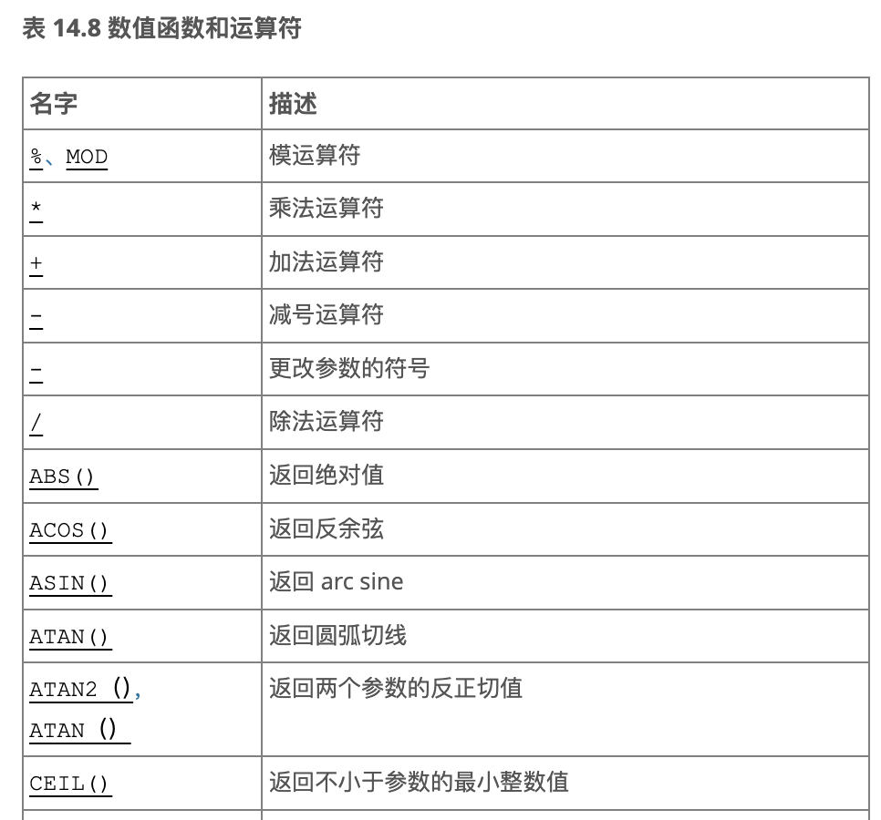

在 **MySQL** 中，并**没有一个和 PostgreSQL 的 `pg_proc.dat` 相对应的集中式配置文件。** MySQL 的内置函数并不是通过数据驱动的方式注册的，而是通过 **C++ 类的方式硬编码**。

## 查询解析和执行流程

**查询解析**：查询首先被解析成一个结构化的 `Lex` 结构。

**运行时状态**：每个连接的状态通过 `THD` 进行维护，并包含当前执行的查询信息。

**数据项转换**：查询中的数据和表达式会被转换成不同的 `Item_*` 对象，方便后续的执行和评估。

在查询执行的过程中，有三个关键的数据结构，它们对于存储过程的实现至关重要：

1. **Lex**：

    - `Lex` 结构是**已解析的查询**，它是解析器（`yyparse()`）的输出，包含了查询的所有细节，并在后续阶段用来实际执行查询。

    - 其中包含一个 `enum` 类型的值（`sql_command`），表示查询的类型（例如，`SELECT`、`INSERT`、`UPDATE` 等）。

    - 此外，`Lex` 结构还包括了查询中所有需要的数据，比如：表名、字段名、值等。

1. **THD**（线程上下文）：

    - `THD` 结构表示**连接的运行时状态**，它包含了与某个客户端连接相关的所有信息。具体来说，`THD` 中保存了当前正在执行的 `Lex` 结构，因此它在执行查询时，能够知道当前执行的是哪个查询。

1. **Item_*（数据项）**：

    - 在解析过程中，所有的查询数据都会被转换成 **"Item" 类型的对象**。这些对象是 `Item` 类的子类（如 `Item_int`、`Item_real`、`Item_string` 等），它们表示基本数据类型。

    - 同时，对于需要计算或评估的表达式，还会有更专业化的 `Item_*` 类型对象（例如 `Item_func` 类），它们表示查询中的操作符或函数。

## 存储过程（Stored Procedure）与存储函数（Stored Function）

**存储过程（Stored Procedure）** 是一种在数据库中预编译并存储的 SQL 代码集合。它允许你将一组 SQL 语句封装在一个单独的、可重用的块中，并且通过调用这个块来执行其中的所有 SQL 语句。

**存储过程的特点：**

- **一组预编译的 SQL 语句**：存储过程可以包含多个 SQL 语句（如 `SELECT`、`INSERT`、`UPDATE`、`DELETE` 等），它们在数据库中作为一个单元进行存储和执行。

- **封装和复用**：存储过程允许你将常用的数据库操作封装在一个独立的对象中，避免重复书写相同的 SQL 代码。

- **可执行性**：存储过程是通过 `CALL` 语句进行调用的，类似于函数调用，但它的功能不仅限于计算结果，还可以执行对数据库的增删改查等操作。

- **支持参数**：存储过程可以接受输入参数，并且也可以返回输出参数。

**示例**

```SQL
DELIMITER $$

CREATE PROCEDURE get_employee_info(IN emp_id INT)
BEGIN
    SELECT * FROM employees WHERE employee_id = emp_id;
END$$

DELIMITER ;

// 调用
CALL get_employee_info(101);
```

**存储函数（Stored Function）** 也是存储在数据库中的 SQL 代码，但与存储过程不同的是，它是用于**计算并返回一个值**的。存储函数像普通函数一样在 SQL 语句中作为表达式使用。

**存储函数的特点：**

- **返回单一值**：存储函数必须返回一个值，通常用于在查询中作为计算的一部分。

- **可以在 SQL 语句中直接调用**：你可以在 `SELECT`、`WHERE`、`ORDER BY` 等 SQL 语句的任何地方直接使用存储函数。

- **输入参数**：存储函数通常接受输入参数，用来在函数内部进行计算。

## 存储函数的处理

存储函数不像存储过程那样有显式的 `CALL` 关键字，它们出现在表达式中，使用的语法是 `fun(arg, ...)`。

**存储函数的检测：**

- 存储函数的存在通过词法分析来检查，具体是在 `sql_lex.cc` 文件中的 `find_keyword()` 函数中进行的。这意味着存储函数的检查发生在查询解析的早期阶段，且存储函数必须在被引用之前就已经存在。

- 初期的存储函数实现和 UDF 类似，都是通过 `SP_FUNC` 令牌来标记存储函数。存储函数的解析并不会立即进行，而是在后续的执行过程中才会进行。

**存储函数的解析：**

- 当表达式解析器遇到带有参数的 `SP_FUNC` 令牌时，会创建一个 `Item_func_sp` 类的实例。不同于 UDF，存储函数没有不同的类来处理不同的返回类型，因为在解析阶段我们无法确定返回类型。

- 在解析过程中收集所有引用的存储函数的名称。然后，在 `mysql_execute_command()` 中开始执行之前，从数据库中读取所有存储函数，并将其保存在 `THD`（线程上下文）中。此时，函数可以通过 `sp_find_function()` 查找到。

# 源码定位方式

MySQL的函数源码无法进行类似 PostgreSQL 的搜索定位（原因在开头介绍），官方也没有提供相关的映射文档。因此只有靠找到某一类函数的实现文件并以此推广。根据文档中的函数解析过程介绍，函数`FUNC`的源码实现为`Item_*`类。

最初可以询问大模型，方便快速了解。


阅读源码验证后发现大模型给出的回答较为准确，由此可以在函数对应类别的文件中直接搜索某一函数。例如数学函数ABS、CEIL都在item_func.cc中实现，对应的类名为`Item_func_FUNC`。可以发现的规律是，函数`FUNC`在文件`item_XXX.cc`中的类名为`Item_XXX_FUNC`。

但如果遇到个别特殊的函数，可能需要直接询问此函数的实现位置，通常大模型能给出较准确的回答，目前没有遇到错误的情况。

# 数值函数与运算符（14.6）

文档中的部分函数列表如下



## **ABS**(x)

取绝对值

```C++
class Item_func_abs final : public Item_func_num1 {
 public:
  Item_func_abs(const POS &pos, Item *a) : Item_func_num1(pos, a) {}  //构造函数
  double real_op() override;  //实现浮点数绝对值函数
  longlong int_op() override; //实现整数绝对值函数
  my_decimal *decimal_op(my_decimal *) override;  //依赖sql-common/my_decimal.h，my_decimal 类的目的是限制 decimal_t 类型的使用范围，使其适合 MySQL 的需求。
  const char *func_name() const override { return "abs"; }  //返回函数名称
  bool resolve_type(THD *) override;  //解析类型
  bool check_partition_func_processor(uchar *) override { return false; }
  bool check_function_as_value_generator(uchar *) override { return false; }
  enum Functype functype() const override { return ABS_FUNC; }
};
```

```C++
double Item_func_abs::real_op() {
  const double value = args[0]->val_real();
  null_value = args[0]->null_value;
  return fabs(value);
}

longlong Item_func_abs::int_op() {
  const longlong value = args[0]->val_int();
  if ((null_value = args[0]->null_value)) return 0;
  if (unsigned_flag) return value;
  /* -LLONG_MIN = LLONG_MAX + 1 => outside of signed longlong range */
  if (value == LLONG_MIN) return raise_integer_overflow();
  return (value >= 0) ? value : -value;
}

my_decimal *Item_func_abs::decimal_op(my_decimal *decimal_value) {
  my_decimal val, *value = args[0]->val_decimal(&val);
  if (!(null_value = args[0]->null_value)) {
    my_decimal2decimal(value, decimal_value);
    if (decimal_value->sign()) my_decimal_neg(decimal_value);
    return decimal_value;
  }
  return nullptr;
}

bool Item_func_abs::resolve_type(THD *thd) {
  if (Item_func_num1::resolve_type(thd)) return true;
  unsigned_flag = args[0]->unsigned_flag;
  return false;
}
```

## **SQRT**(x)

返回非负数 X 的平方根

```C++
class Item_func_sqrt final : public Item_dec_func {
 public:
  Item_func_sqrt(const POS &pos, Item *a) : Item_dec_func(pos, a) {}
  double val_real() override;
  const char *func_name() const override { return "sqrt"; }
  enum Functype functype() const override { return SQRT_FUNC; }
};
```

```C++
double Item_func_sqrt::val_real() {
  assert(fixed);
  const double value = args[0]->val_real();
  if ((null_value = (args[0]->null_value || value < 0)))
    return 0.0; /* purecov: inspected */
  return sqrt(value);
}
```

```C++
//
// Integer square root:
//
template <class B, expression_template_option ExpressionTemplates>
inline BOOST_MP_CXX14_CONSTEXPR typename std::enable_if<number_category<B>::value == number_kind_integer, number<B, ExpressionTemplates> >::type
sqrt(const number<B, ExpressionTemplates>& x)
{
   using default_ops::eval_integer_sqrt;
   number<B, ExpressionTemplates> s, r;
   eval_integer_sqrt(s.backend(), r.backend(), x.backend());
   return s;
}
template <class tag, class A1, class A2, class A3, class A4>
inline BOOST_MP_CXX14_CONSTEXPR typename std::enable_if<number_category<typename detail::expression<tag, A1, A2, A3, A4>::result_type>::value == number_kind_integer, typename detail::expression<tag, A1, A2, A3, A4>::result_type>::type
         sqrt(const detail::expression<tag, A1, A2, A3, A4>& arg)
{
   using default_ops::eval_integer_sqrt;
   using result_type = typename detail::expression<tag, A1, A2, A3, A4>::result_type;
   detail::scoped_default_precision<result_type> precision_guard(arg);
   result_type                                   result, v(arg), r;
   eval_integer_sqrt(result.backend(), r.backend(), v.backend());
   return result;
}
```

## **CEIL**(x)

返回不小于 X 的最小整数值

```C++
class Item_func_ceiling final : public Item_func_int_val {
 public:
  Item_func_ceiling(Item *a) : Item_func_int_val(a) {}
  Item_func_ceiling(const POS &pos, Item *a) : Item_func_int_val(pos, a) {}
  const char *func_name() const override { return "ceiling"; }
  longlong int_op() override;
  double real_op() override;
  my_decimal *decimal_op(my_decimal *) override;
  bool check_partition_func_processor(uchar *) override { return false; }
  bool check_function_as_value_generator(uchar *) override { return false; }
  enum Functype functype() const override { return CEILING_FUNC; }
};
```

```C++
longlong Item_func_ceiling::int_op() {
  longlong result;
  switch (args[0]->result_type()) {
    case INT_RESULT:
      result = args[0]->val_int();
      null_value = args[0]->null_value;
      break;
    case DECIMAL_RESULT: {
      my_decimal dec_buf, *dec;
      if ((dec = Item_func_ceiling::decimal_op(&dec_buf)))
        my_decimal2int(E_DEC_FATAL_ERROR, dec, unsigned_flag, &result);
      else
        result = 0;
      break;
    }
    default:
      result = (longlong)Item_func_ceiling::real_op();
  };
  return result;
}

double Item_func_ceiling::real_op() {
  const double value = args[0]->val_real();
  null_value = args[0]->null_value;
  return ceil(value);
}

my_decimal *Item_func_ceiling::decimal_op(my_decimal *decimal_value) {
  my_decimal val, *value = args[0]->val_decimal(&val);
  if (!(null_value =
            (args[0]->null_value ||
             my_decimal_ceiling(E_DEC_FATAL_ERROR, value, decimal_value) > 1)))
    return decimal_value;
  return nullptr;
}
```

# 字符串函数和运算符（14.8)

## LIKE

expr **LIKE** pat [ESCAPE 'escape_char']，SQL模式的模式匹配，返回0，1，NULL

```C++
class Item_func_like final : public Item_bool_func2 {
  /// True if escape clause is const (a literal)
  bool escape_is_const = false;
  /// Tells if the escape clause has been evaluated.
  bool escape_evaluated = false;
  bool eval_escape_clause(THD *thd);
  /// The escape character (0 if no escape character).
  int m_escape;

 public:
  //构造函数
  Item_func_like(Item *a, Item *b) : Item_bool_func2(a, b) {}
  Item_func_like(Item *a, Item *b, Item *escape_arg)
      : Item_bool_func2(a, b, escape_arg) {
    assert(escape_arg != nullptr);
  }
  Item_func_like(const POS &pos, Item *a, Item *b, Item *escape_arg)
      : Item_bool_func2(pos, a, b, escape_arg) {
    assert(escape_arg != nullptr);
  }
  Item_func_like(const POS &pos, Item *a, Item *b)
      : Item_bool_func2(pos, a, b) {}

  longlong val_int() override;
  enum Functype functype() const override { return LIKE_FUNC; }
  optimize_type select_optimize(const THD *thd) override;
  /// Result may be not equal with equal inputs if ESCAPE character is present
  cond_result eq_cmp_result() const override { return COND_OK; }
  const char *func_name() const override { return "like"; }
  bool fix_fields(THD *thd, Item **ref) override;
  bool resolve_type(THD *) override;
  void cleanup() override;
  Item *replace_scalar_subquery(uchar *) override;
  // Overridden because Item_bool_func2::print() doesn't print the ESCAPE
  // clause.
  void print(const THD *thd, String *str,
             enum_query_type query_type) const override;
  /**
    @retval true non default escape char specified
                 using "expr LIKE pat ESCAPE 'escape_char'" syntax
  */
  bool escape_was_used_in_parsing() const { return arg_count > 2; }

  /// Returns the escape character.
  int escape() const {
    assert(escape_is_evaluated());
    return m_escape;
  }

  /**
    Has the escape clause been evaluated? It only needs to be evaluated
    once per execution, since we require it to be constant during execution.
    The escape member has a valid value if and only if this function returns
    true.
  */
  bool escape_is_evaluated() const { return escape_evaluated; }

  float get_filtering_effect(THD *thd, table_map filter_for_table,
                             table_map read_tables,
                             const MY_BITMAP *fields_to_ignore,
                             double rows_in_table) override;

 private:
  /**
    The method updates covering keys depending on the
    length of wild string prefix.

    @param thd Pointer to THD object.

    @retval true if error happens during wild string prefix calculation,
            false otherwise.
  */
  bool check_covering_prefix_keys(THD *thd);
};
```

```C++
bool Item_func_like::resolve_type(THD *thd) {
  // Function returns 0 or 1
  max_length = 1;

  // Determine the common character set for all arguments
  if (agg_arg_charsets_for_comparison(cmp.cmp_collation, args, arg_count))
    return true;

  for (uint i = 0; i < arg_count; i++) {
    if (args[i]->data_type() == MYSQL_TYPE_INVALID &&
        args[i]->propagate_type(
            thd,
            Type_properties(MYSQL_TYPE_VARCHAR, cmp.cmp_collation.collation))) {
      return true;
    }
  }

  if (reject_geometry_args()) return true;
  if (reject_vector_args()) return true;

  // LIKE is always carried out as a string operation
  args[0]->cmp_context = STRING_RESULT;
  args[1]->cmp_context = STRING_RESULT;

  if (arg_count > 2) {
    args[2]->cmp_context = STRING_RESULT;

    // ESCAPE clauses that vary per row are not valid:
    if (!args[2]->const_for_execution()) {
      my_error(ER_WRONG_ARGUMENTS, MYF(0), "ESCAPE");
      return true;
    }
  }
  /*
    If the escape item is const, evaluate it now, so that the range optimizer
    can try to optimize LIKE 'foo%' into a range query.

    TODO: If we move this into escape_is_evaluated(), which is called later,
          we might be able to optimize more cases.
  */
  if (!escape_was_used_in_parsing() || args[2]->const_item()) {
    escape_is_const = true;
    if (!(thd->lex->context_analysis_only & CONTEXT_ANALYSIS_ONLY_VIEW)) {
      if (eval_escape_clause(thd)) return true;
      if (check_covering_prefix_keys(thd)) return true;
    }
  }

  return false;
}

//剩余代码过多，略
```

## STRCMP（）

**STRCMP**(expr1,expr2)，字符串比较

```C++
class Item_func_strcmp final : public Item_bool_func2 {
 public:
  Item_func_strcmp(const POS &pos, Item *a, Item *b)
      : Item_bool_func2(pos, a, b) {}
  longlong val_int() override;
  optimize_type select_optimize(const THD *) override { return OPTIMIZE_NONE; }
  const char *func_name() const override { return "strcmp"; }
  enum Functype functype() const override { return STRCMP_FUNC; }

  void print(const THD *thd, String *str,
             enum_query_type query_type) const override {
    Item_func::print(thd, str, query_type);
  }
  // We derive (indirectly) from Item_bool_func, but this is not a true boolean.
  // Override length and unsigned_flag set by set_data_type_bool().
  bool resolve_type(THD *thd) override {
    if (Item_bool_func2::resolve_type(thd)) return true;
    fix_char_length(2);  // returns "1" or "0" or "-1"
    unsigned_flag = false;
    return false;
  }
};
```

```C++
longlong Item_func_strcmp::val_int() {
  assert(fixed);
  const CHARSET_INFO *cs = cmp.cmp_collation.collation;
  String *a = eval_string_arg(cs, args[0], &cmp.value1);
  if (a == nullptr) {
    if (current_thd->is_error()) return error_int();
    null_value = true;
    return 0;
  }

  String *b = eval_string_arg(cs, args[1], &cmp.value2);
  if (b == nullptr) {
    if (current_thd->is_error()) return error_int();
    null_value = true;
    return 0;
  }
  const int value = sortcmp(a, b, cs);
  null_value = false;
  return value == 0 ? 0 : value < 0 ? -1 : 1;
}
```

## REGEXP（）

expr **REGEXP** pat，字符串 expr 与模式 pat指定的正则表达式匹配

```C++
class Item_func_regexp : public Item_func {
 public:
  Item_func_regexp(const POS &pos, PT_item_list *opt_list)
      : Item_func(pos, opt_list) {}

  /**
    Resolves the collation to use for comparison. The type resolution is done
    in the subclass constructors.

    For all regular expression functions, i.e. REGEXP_INSTR, REGEXP_LIKE,
    REGEXP_REPLACE and REGEXP_SUBSTR, it goes that the first two arguments
    have to agree on a common collation. This collation is used to control
    case-sensitivity.

    @see fix_fields()
  */
  bool resolve_type(THD *) override;

  /// Decides on the mode for matching, case sensitivity etc.
  bool fix_fields(THD *thd, Item **) override;

  /// The expression for the subject string.
  Item *subject() const { return args[0]; }

  /// The expression for the pattern string.
  Item *pattern() const { return args[1]; }

  /// The value of the `position` argument, or its default if absent.
  std::optional<int> position() const {
    const int the_index = pos_arg_pos();
    if (the_index != -1 && arg_count >= static_cast<uint>(the_index) + 1) {
      const int value = args[the_index]->val_int();
      /*
        Note: Item::null_value() can't be trusted alone here; there are cases
        (for the DATE data type in particular) where we can have it set
        without Item::m_nullable being set! This really should be cleaned up,
        but until that happens, we need to have a more conservative check.
      */
      if (args[the_index]->is_nullable() && args[the_index]->null_value)
        return {};
      else
        return value;
    }
    return 1;
  }
  
//剩余较多代码，略
```

```C++
bool Item_func_regexp::resolve_type(THD *thd) {
  if (param_type_is_default(thd, 0, 2)) return true;

  const CHARSET_INFO *subject_charset = subject()->charset_for_protocol();
  const CHARSET_INFO *pattern_charset = pattern()->charset_for_protocol();

  if ((is_binary_string(subject()) && !is_binary_compatible(pattern())) ||
      (is_binary_string(pattern()) && !is_binary_compatible(subject()))) {
    my_error(ER_CHARACTER_SET_MISMATCH, myf(0), subject_charset->m_coll_name,
             pattern_charset->m_coll_name, func_name());
    return error_bool();
  }

  return agg_arg_charsets_for_comparison(collation, args, 2);
}

bool Item_func_regexp::fix_fields(THD *thd, Item **arguments) {
  if (Item_func::fix_fields(thd, arguments)) return true;

  m_facade = make_unique_destroy_only<regexp::Regexp_facade>(thd->mem_root);

  fixed = true;

  // There may be errors evaluating arguments.
  return thd->is_error();
}

void Item_func_regexp::cleanup() {
  if (m_facade != nullptr) m_facade->cleanup();
  Item_func::cleanup();
}

bool Item_func_regexp::set_pattern() {
  auto mp = match_parameter();
  if (!mp.has_value()) return true;

  bool is_case_sensitive =
      (((collation.collation->state & (MY_CS_CSSORT | MY_CS_BINSORT)) != 0));

  uint32_t icu_flags = 0;  // Avoids compiler warning on gcc 4.8.5.
  // match_parameter overrides coercion type.
  if (ParseRegexpOptions(mp.value(), is_case_sensitive, &icu_flags)) {
    my_error(ER_WRONG_ARGUMENTS, MYF(0), func_name());
    return true;
  }

  return m_facade->SetPattern(pattern(), icu_flags);
}
```

