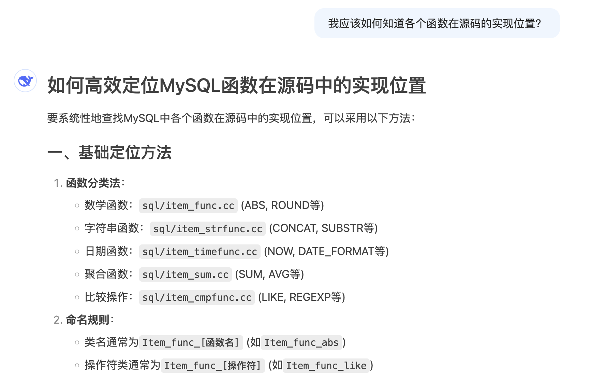

# 源码定位方式

MySQL的函数源码无法进行类似 PostgreSQL 的搜索定位（原因在开头介绍），官方也没有提供相关的映射文档。因此只有靠找到某一类函数的实现文件并以此推广。根据文档中的函数解析过程介绍，函数`FUNC`的源码实现为`Item_*`类。

最初可以询问大模型，方便快速了解。

阅读源码验证后发现大模型给出的回答较为准确，由此可以在函数对应类别的文件中直接搜索某一函数。例如数学函数ABS、CEIL都在item_func.cc中实现，对应的类名为`Item_func_FUNC`。可以发现的规律是，函数`FUNC`在文件`item_XXX.cc`中的类名为`Item_XXX_FUNC`。

但如果遇到个别特殊的函数，可能需要直接询问此函数的实现位置，通常大模型能给出较准确的回答，目前没有遇到错误的情况。