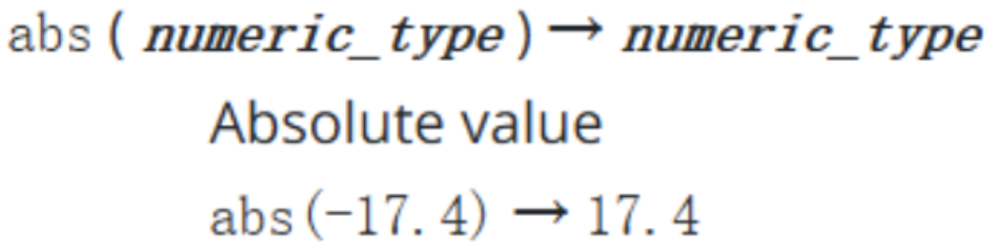
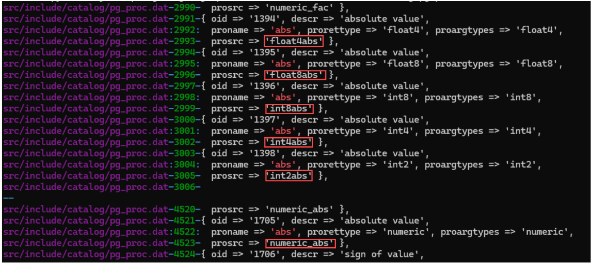

## 查找 PostgreSQL 指定功能源代码的方法

### 1.标准流程（以 abs 函数为例）

- 在官网中找到函数描述，提取这个函数的函数名即可



- 在仓库中搜索这个函数

  - 命令行输入如下：

    - ```
      git grep -n -C 2 "'abs'" src/include/catalog/pg_proc.dat
      // 单引号中填函数名
      ```


  - 输出结果如下：

    - 


  - 只需要关注 proname 和 prosrc 两个属性，proname 是官网给出的用户使用的函数，prosrc 是源代码中实现该函数的函数


- 使用 understand 找出仓库中每个函数分别在哪个文件中

- 找到这个函数的源代码和相关代码

### 2.通过脚本一键实现

- 把需要处理的功能在官网上描述的函数名和函数描述提取至 functions.csv 文件中（例：abs,Absolute value）

- 运行 sample.py 文件

- 结果

  - ```json
    {
        "abs": {
            "float4abs": [
                {
                    "D:\\JXMYJ\\pythonProjects\\postgres\\src\\include\\fmgr.h": "#define PG_FUNCTION_ARGS FunctionCallInfo fcinfo\n#define PG_GETARG_DATUM (fcinfo->args[n].value)\n#define PG_GETARG_FLOAT4 DatumGetFloat4(PG_GETARG_DATUM(n))\n#define PG_RETURN_FLOAT4 return Float4GetDatum(x)",
                    "D:\\JXMYJ\\pythonProjects\\postgres\\src\\include\\postgres.h": "static inline float4\nDatumGetFloat4(Datum X)\n{\n\tunion\n\t{\n\t\tint32\t\tvalue;\n\t\tfloat4\t\tretval;\n\t}\t\t\tmyunion;\n\n\tmyunion.value = DatumGetInt32(X);\n\treturn myunion.retval;\n}\nstatic inline Datum\nFloat4GetDatum(float4 X)\n{\n\tunion\n\t{\n\t\tfloat4\t\tvalue;\n\t\tint32\t\tretval;\n\t}\t\t\tmyunion;\n\n\tmyunion.value = X;\n\treturn Int32GetDatum(myunion.retval);\n}"
                },
                {
                    "D:\\JXMYJ\\pythonProjects\\postgres\\src\\backend\\utils\\adt\\float.c": "Datum\nfloat4abs(PG_FUNCTION_ARGS)\n{\n\tfloat4\t\targ1 = PG_GETARG_FLOAT4(0);\n\n\tPG_RETURN_FLOAT4(fabsf(arg1));\n}"
                }
            ],
            "float8abs": [
                {
                    "D:\\JXMYJ\\pythonProjects\\postgres\\src\\backend\\utils\\fmgr\\fmgr.c": "Datum\nFloat8GetDatum(float8 X)\n{\n\tfloat8\t   *retval = (float8 *) palloc(sizeof(float8));\n\n\t*retval = X;\n\treturn PointerGetDatum(retval);\n}"
                },
                {
                    "D:\\JXMYJ\\pythonProjects\\postgres\\src\\backend\\utils\\adt\\float.c": "Datum\nfloat8abs(PG_FUNCTION_ARGS)\n{\n\tfloat8\t\targ1 = PG_GETARG_FLOAT8(0);\n\n\tPG_RETURN_FLOAT8(fabs(arg1));\n}"
                }
            ]
        },
        "cbrt": {
            ...
        }
    }
    ```
    
  - 最终返回结果是一个字典，最外层键为函数名（abs），里面包含的是源代码相关函数的字典（float4abs，float8abs），这个字典内部是函数内容的列表，列表长度为2，内部元素为字典（注：第一个元素是依赖代码，第二个元素是对应函数的函数体），字典的键是文件位置，值是对应代码


## 使用模型生成指定函数

- 把需要生成的函数的函数名和函数描述填入 functions.csv 文件
- 在提供上下文依赖的前提下生成：运行 sample.py 文件
- 在不提供上下文依赖的前提下生成：运行 sampleWithoutDep.py 文件


